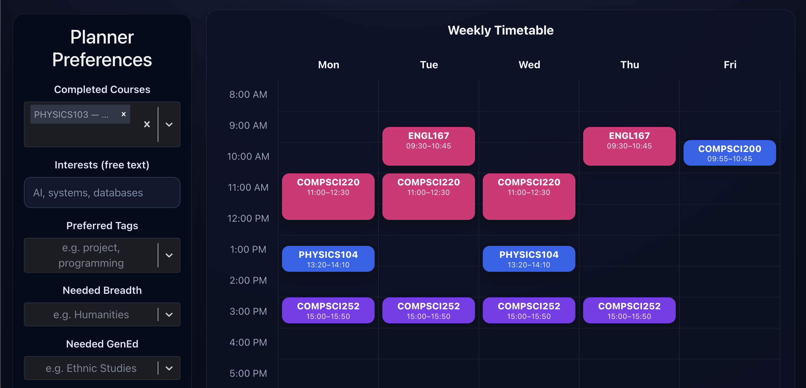

# CourseFlow

A course scheduler for UW-Madison students. Pick your interests, breadth requirements, and credit range — CourseFlow generates ranked, conflict-free schedules from the real course catalog.

**Live demo:** https://courseflow.vercel.app <!-- TODO: replace with your actual Vercel URL -->
**API:** https://courseflow-api.fly.dev/health <!-- TODO: replace with your actual Fly URL -->

 <!-- TODO: drop a PNG here after deploy -->

---

## What it does

Given:
- Courses you've already completed
- Interests, preferred tags, required breadth/GenEd
- A credit range and max difficulty

CourseFlow:
1. Filters the catalog to courses whose prerequisites you've satisfied
2. Scores each course by how well it matches your preferences
3. Runs a backtracking search for conflict-free schedules that hit your credit target
4. Returns the top-ranked results

Backed by real UW-Madison data — course listings, prerequisites, meeting times, and historical GPAs — extracted from the [uw-coursemap](https://github.com/twangodev/uw-coursemap) project via a custom ETL script.

## Architecture

```
┌─────────────────────┐   HTTPS/JSON    ┌──────────────────────┐
│  React + Vite       │ ───────────────>│  Express + Node      │
│  (Vercel)           │                  │  (Fly.io, Chicago)   │
│                     │ <────────────── │                      │
│  TanStack Query     │                  │  Repository pattern  │
│  react-select       │                  │  courses.json (54)   │
└─────────────────────┘                  └──────────────────────┘
                                                   ▲
                                                   │ ETL at build time
                                          ┌────────┴───────────┐
                                          │  uw-coursemap-data │
                                          │  (GitHub submodule)│
                                          └────────────────────┘
```

**Frontend** (`frontend/`) — React 19 + Vite + TypeScript. Uses TanStack Query to manage server state and `react-select` for the multi-select UI. No direct database or file access; it's a pure HTTP client of the backend.

**Backend** (`backend/`) — Express + TypeScript on Node 20. Routes:
- `GET /health` — liveness probe
- `GET /courses` — full catalog
- `GET /courses/meta` — distinct breadths, gen-eds, and tags for form autocompletes
- `POST /plan` — runs the scoring + scheduling pipeline

Catalog data lives in `backend/data/courses.json`, produced by `backend/src/scripts/ingest.ts` from upstream uw-coursemap data. Repository pattern keeps the data source swappable (in-memory today; SQLite or Postgres later is a one-file change).

## Running locally

Prereqs: Node 20+, npm.

```bash
# 1. Backend
cd backend
npm install
npm run dev          # http://localhost:3001

# 2. Frontend (new terminal)
cd frontend
npm install
npm run dev          # http://localhost:5173
```

That's it — the catalog is committed, no ingest step needed to run the app.

### Regenerating the catalog

If you want to extend the course list (add subjects, pull fresher upstream data):

```bash
cd backend
git clone https://github.com/twangodev/uw-coursemap-data ../uw-coursemap-data
npm run ingest       # writes data/courses.json
```

Edit `TARGET_SUBJECTS` in `src/scripts/ingest.ts` to control which departments are included.

## Deployment

### Backend → Fly.io

```bash
# One-time
cd backend
fly auth signup          # or fly auth login
fly launch --no-deploy   # accept the existing fly.toml; pick a unique app name if prompted
fly secrets set CORS_ORIGIN="https://<your-vercel-url>"

# Every deploy
fly deploy
```

### Frontend → Vercel

```bash
cd frontend
# Easiest: connect the GitHub repo at https://vercel.com/new and point it at frontend/
# Then in Vercel → Project Settings → Environment Variables, set:
#   VITE_API_BASE_URL = https://<your-fly-app>.fly.dev
```

Any push to `main` auto-deploys.

## What I built

- **ETL pipeline** — translates uw-coursemap's nested JSON (per-term grade data, AST-style prerequisite expressions, epoch-timestamped class meetings) into a flat, frontend-friendly catalog. Handles the session-to-weekly-pattern mismatch by grouping meetings by section and deduping on (day, start, end).
- **Scoring heuristic** — combines tag match, breadth/gen-ed coverage, and difficulty fit.
- **Conflict-free schedule backtracker** — generates combinations that hit the target credit range without overlapping class times.
- **Clean client/server split** — frontend and backend deploy independently; types duplicated at the API boundary instead of imported across the wire.
- **Env-driven config** — `VITE_API_BASE_URL`, `CORS_ORIGIN`, `PORT` all externalized so local dev and production share the same code.

## Tech stack

| Layer      | Tools                                                |
|------------|-------------------------------------------------------|
| Frontend   | React 19, TypeScript, Vite, TanStack Query, react-select |
| Backend    | Express, TypeScript, Node 20                          |
| Data       | uw-coursemap (ingested at build time)                 |
| Hosting    | Fly.io (API, Docker), Vercel (static frontend)        |

## Roadmap

- Vitest suite covering scoring, prerequisite unlocking, and the schedule backtracker
- GPA-based grade-boost signal in scoring (data is already ingested)
- Persistent user profiles (SQLite behind the existing `CourseRepository` interface)
- Cap the backtracker's internal search (currently hits a slice limit in the response, but can still explode internally on permissive queries)

## License

MIT — do what you want.
